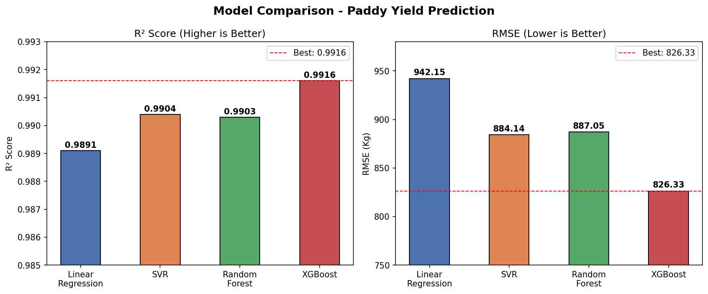
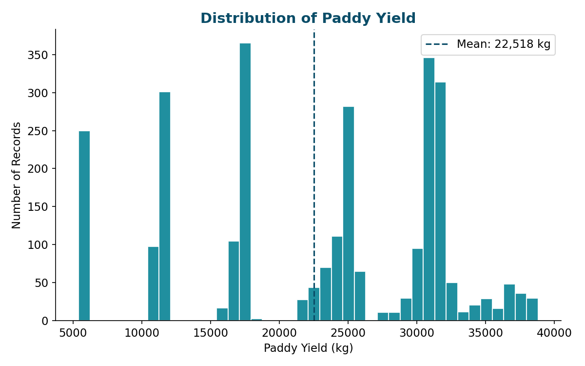
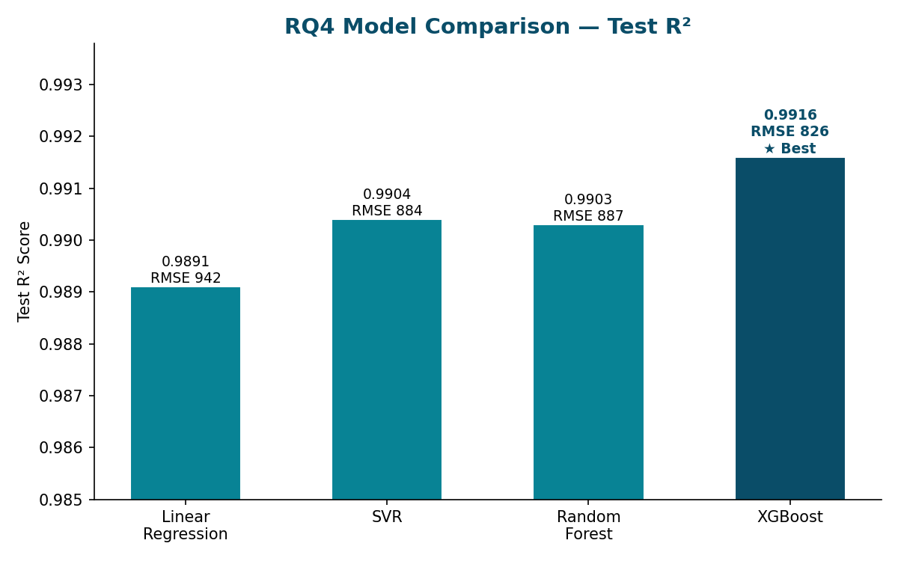

# Paddy Yield Prediction with Machine Learning

Predicting rice (paddy) yield from climate and agricultural management data — comparing
feature-selection strategies, ensemble models, and decision-support groupings for
precision agriculture.

**Course:** IS 407 — Introduction to Data Science, UIUC (Spring 2026)
**Team:** Ke Xu, Maya Bernstein, Qiuyu Wu, Hsin-Tzu Lin, Zih-Yi Cao
**My role:** Built the model-benchmarking pipeline (RQ4) — preprocessing, 4-model
comparison, and results visualization (see `notebooks/`).

## Overview

Rice is one of the world's most important staple crops, and accurate yield forecasts help
farmers and planners allocate fertilizer, labor, and food-supply resources. Using a public
farming dataset from the UCI Machine Learning Repository (**2,789 records, 44 predictors**),
this project investigates which combinations of environmental conditions and management
practices best predict paddy yield, and how those predictions can be turned into practical
decision-support categories.

## Key Findings

- **Management beats weather.** Climate variables alone showed near-zero correlation with
  yield (max |r| = 0.020, none significant) and a climate-only Random Forest scored a
  5-fold CV R² of −18.2, vs. +0.22 once management, soil, and variety features were added.
  Human-controlled practices (fertilizer use, nursery preparation, seed rate) were the
  dominant predictors.
- **Best model: gradient boosting.** Across Linear Regression, SVR, Random Forest, and
  gradient boosting (XGBoost), gradient boosting won with **test R² = 0.9916 and
  RMSE = 826 kg** on a held-out 20% test set.
- **Feature selection helped too.** A parallel analysis showed Random Forest with
  mutual-information feature selection reaching test R² = 0.9915 with the smallest
  train–test overfitting gap — fewer, better features beat more features.
- **Diagnosed a data trap.** Management inputs were near-perfectly collinear (pairwise
  r ≈ 0.99), so individual practices couldn't be disentangled. The team built a PCA-based
  *management-intensity index* (first component ≈ 100% of variance) to restore a valid,
  interpretable model.
- **From predictions to decisions.** K-means clustering translated predicted yields into
  low/medium/high productivity categories; low- and high-yield fields separated cleanly,
  giving a practical screening tool for targeted field monitoring.



## My Contribution (RQ4 — Model Benchmarking)

- Designed a scikit-learn `Pipeline` + `ColumnTransformer` preprocessing workflow:
  `StandardScaler` for numeric features, `OneHotEncoder` for categoricals.
- Split data 80/20 (`random_state=42`) and benchmarked four regressors under identical
  conditions: Multiple Linear Regression, SVR (RBF kernel wrapped in
  `TransformedTargetRegressor` for target scaling), Random Forest, and Gradient Boosting.
- Evaluated with R² and RMSE on the held-out test set; produced the model-comparison
  visualization used in the final presentation.

## Methods Pipeline

| Step | Techniques |
|---|---|
| Climate analysis (RQ1) | Pearson correlation by growth stage (D1–30 … D91–120), Random Forest feature importance, climate-only vs. full-feature CV benchmark |
| Feature selection (RQ2) | Mutual information (SelectKBest), RFE, LASSO, tree-based importance; overfitting-gap comparison |
| Management effects (RQ3) | PCA composite index, GAM for non-linear effects, OLS with assumption diagnostics (VIF, Q-Q, residual plots) |
| Model benchmarking (RQ4) | Linear Regression, SVR, Random Forest, Gradient Boosting (XGBoost) — 80/20 split, R² / RMSE |
| Decision support (RQ5) | K-means clustering into productivity categories, profiled by field characteristics |

## Tech Stack

Python (pandas, scikit-learn, matplotlib, numpy), R

## Repository Structure

```
paddy-yield-prediction/
├── README.md
├── requirements.txt
├── notebooks/
│   └── Zih-Yi_Cao.ipynb        # RQ4: preprocessing + 4-model benchmark (my work)
├── figures/
│   └── model_comparison.png
├── reports/
│   ├── Final_Paper.pdf
│   ├── Executive_Summary.pdf
│   └── IS_407_Final_Project.pptx
└── data/
    └── paddydataset.csv        # UCI ML Repository, Paddy crop dataset
```

## Reproduce

```bash
pip install -r requirements.txt
# open notebooks/Zih-Yi_Cao.ipynb — expects data/paddydataset.csv alongside
```

## Limitations

- Test R² near 0.99 partly reflects low variability in this single-region dataset rather than
  true generalizability — treat as a modeling exercise, not a production forecast.
- Climate columns are 30-day aggregates with only 3–7 distinct values; short extreme
  weather events during sensitive growth stages are invisible.
- Findings should be validated on other regions and farming systems.

## References

- Muthukumaran et al. (2023). A hybrid machine learning model … *Int. J. of Electronics and Communication Engineering.*
- Jeong et al. (2016). Random forests for global and regional crop yield predictions. *PLOS ONE.*
- Sah et al. (2024). Rice yield prediction … *Scientific Reports.*
- Sahoo et al. (2024). Advanced prediction of rice yield gaps … *J. of Agriculture and Food Research.*
- Wickramasinghe et al. (2021). Modeling the relationship between rice yield and climate variables … *J. of Mathematics.*

## Visualizations



